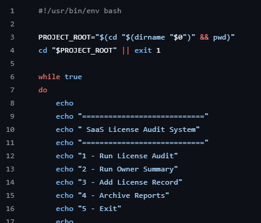
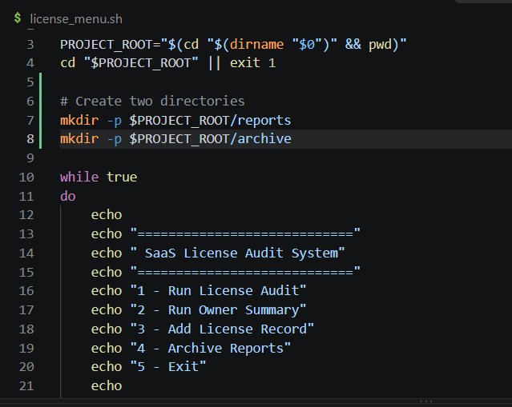
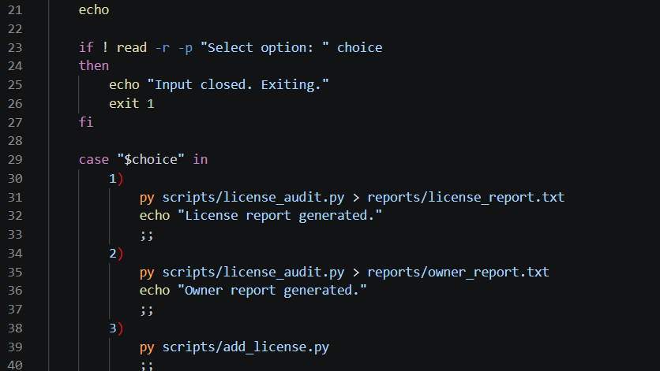

# Debugging Log 
### It walks the system and lists the chsnges
---
These are changes I made to ensure quality execution
Additionally, this is a log of bug fixes and / or logic structural changes made to run the application as requested.
The goal stated was NOT to rearchitect the solution, just get it up and running.

Change #1 - Pre and Post mkdir check

Made a change to allow the menu choice option to open, selection is not a valid variable.

Change #2 - license_menu.sh makmenu option work successfully

